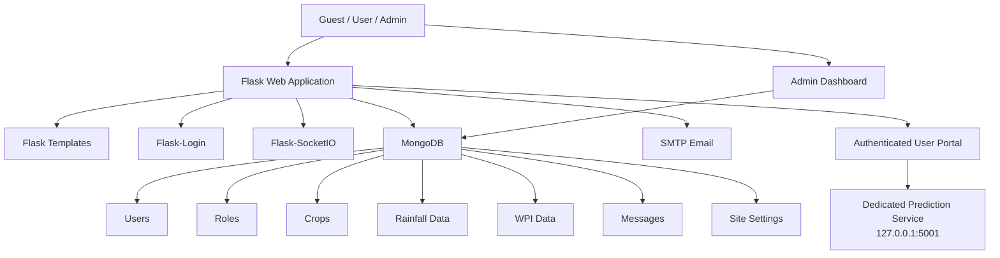

# 🌾 Agriculture Market Price Predictor

<p align="center">
  
  
  
  
  
  
</p>

<p align="center">
  <strong>A Flask + MongoDB agricultural market platform for managing crop master data, rainfall/WPI datasets, users, roles, communications, and the web experience that connects authenticated users to a dedicated prediction service.</strong>
</p>

<p align="center">
  <a href="https://github.com/Swati23216/Agriculture-Market-Price-Predictor">Repository</a> ·
  <a href="#-features">Features</a> ·
  <a href="#-architecture">Architecture</a> ·
  <a href="#-installation">Installation</a> ·
  <a href="#-api-overview">API Overview</a>
</p>

---

## 📌 Project Overview

**Agriculture Market Price Predictor** is a web-based agricultural market platform built with **Python Flask and MongoDB**.

The current repository provides the application layer around an agricultural prediction workflow. It includes:

- 🔐 User registration, login and role-based access
- 👤 User profiles and password management
- 🛡️ Admin dashboard and administration tools
- 🌱 Crop master-data management
- 🌧️ Monthly rainfall data management
- 📊 Monthly WPI (Wholesale Price Index) data management
- 💬 User ↔ Admin messaging
- ⚡ Real-time notifications and messaging using Flask-SocketIO
- 📧 Email-based registration, approval and password-reset workflows
- 🎨 Dynamic website styling and navigation management
- 🖼️ File and profile-image uploads
- 🔗 A dedicated **Prediction** entry point from the authenticated user portal

> **Important implementation note:** The uploaded repository does **not** contain a Random Forest model, `.pkl` model file, scikit-learn training pipeline, or prediction algorithm implementation. The authenticated user portal links to a separate prediction service at `http://127.0.0.1:5001`. Therefore, this README does not claim that the Machine Learning engine itself is implemented inside this repository.

---

# 🎯 Problem & Purpose

Agricultural market analysis requires structured information about crops and the environmental/economic factors associated with them.

This project provides a centralized web application for maintaining the data and user workflows surrounding an agricultural prediction system.

The platform allows administrators to maintain:

```text
Crop Master Data
      +
Year-wise Agricultural Data
      +
Monthly Rainfall
      +
Monthly WPI
      +
Authenticated Users
      +
Role & Communication Management
      ↓
Prediction Workflow
```

The result is a foundation that connects **agricultural data management, user access control, and prediction-service access** in one web application.

---

# ✨ Features

## 🔐 Authentication & User Management

- User registration with role selection
- Password hashing using Werkzeug
- Login/logout using Flask-Login
- Approval workflow for newly registered users
- Pending-role handling before account approval
- Role-based authorization
- Profile management
- Profile-picture upload
- Phone and bio management
- Change-password functionality
- Forgot-password workflow
- OTP-based password reset
- Password reset tokens
- Email notifications during account workflows

### Registration Workflow

```text
User Registration
       ↓
Pending Account
       ↓
Admin Notification
       ↓
Admin Approval
       ↓
Approval Email
       ↓
User Login
```

---

## 🛡️ Admin Dashboard

Administrators have access to management functionality for:

- 👥 Users
- 🏷️ Roles
- 🌱 Crops
- 🌧️ Rainfall & WPI data
- 💬 User messages
- 📧 Email settings
- 🎨 Website styles
- 🧭 Navigation
- 📝 Website content
- 👨‍💼 Pending-user approvals
- 🔎 Site preview
- 📊 Dashboard statistics

---

## 🌱 Crop Management

The admin panel provides CRUD operations for crop master data.

Each crop can contain:

| Field | Description |
|---|---|
| Crop Name | Name of the crop |
| Season | Associated season |
| Area | Associated agricultural area |
| Image | Optional crop image |
| Created At | Creation timestamp |
| Updated At | Last update timestamp |

Supported operations:

- ➕ Add crop
- ✏️ Update crop
- 🗑️ Delete crop
- 📋 List crops
- 🖼️ Upload crop images

Duplicate crop names are checked before insertion/update.

---

# 🌧️ Rainfall & WPI Data Management

The application contains dedicated APIs and an admin interface for maintaining agricultural environmental/economic data.

Each record is associated with:

- 🌱 Crop
- 📅 Year
- 🔢 Base value
- 🌧️ Monthly rainfall values
- 📊 Monthly WPI values
- 🕒 Creation/update timestamps

The frontend provides monthly fields for rainfall and WPI data.

### Data Structure

```text
Crop
 └── Year
      ├── Base Value
      ├── January
      │    ├── Rainfall
      │    └── WPI
      ├── February
      │    ├── Rainfall
      │    └── WPI
      ├── ...
      └── December
           ├── Rainfall
           └── WPI
```

This structure makes the agricultural dataset easier to maintain and provides structured input for the connected prediction workflow.

---

# 💬 Real-Time Communication

The application uses **Flask-SocketIO** for real-time communication.

### User Features

- Send messages to administrators
- Receive admin responses
- View notifications
- Real-time message updates

### Admin Features

- View user conversations
- Reply to users
- Track unread messages
- Mark conversations as read
- Receive real-time notifications

### Communication Flow

```text
User
 │
 │ Message
 ▼
Flask Backend
 │
 ├── MongoDB
 │
 └── Socket.IO
       │
       ▼
Admin Dashboard
 │
 │ Reply
 ▼
User
```

---

# 📧 Email & Account Workflows

The application contains SMTP-based email functionality for account-related workflows.

Implemented workflows include:

- Registration submission notification
- Admin approval notification
- New-user notification to administrators
- Password-reset OTP
- Password-reset email/template support
- Configurable administrator email settings

Email settings are stored through the application's MongoDB configuration.

> **Security:** SMTP credentials must be stored in environment variables or a secure secret manager in production.

---

# 🎨 Dynamic Website Customization

One of the distinctive parts of this project is the administrator-controlled website customization system.

The admin dashboard provides controls for:

### Visual Styling

- Primary color
- Background color
- Font family
- Text color
- Button background
- Button text

### Navigation

Administrators can configure:

- Site name
- Site logo
- Navigation labels
- Navigation URLs

### Page Content

The admin interface includes editable sections for:

- Home content
- About content
- Services content
- Doctors content
- Contact content
- News content

The application stores these settings in MongoDB and uses them when rendering the web interface.

---

# 🏗️ Architecture



---

# 🧰 Technology Stack

| Layer | Technology |
|---|---|
| **Language** | Python |
| **Web Framework** | Flask |
| **Database** | MongoDB |
| **Database Driver** | Flask-PyMongo / PyMongo |
| **Authentication** | Flask-Login |
| **Password Security** | Werkzeug |
| **Real-Time Communication** | Flask-SocketIO + Eventlet |
| **Email** | Python SMTP |
| **Frontend** | HTML5, CSS3, JavaScript |
| **UI Framework** | Bootstrap 5 |
| **Icons** | Font Awesome |
| **Templating** | Jinja2 |
| **File Uploads** | Werkzeug `secure_filename` |
| **Token Handling** | itsdangerous |
| **Configuration** | Environment variables / `.env` |
| **Version Control** | Git / GitHub |

---

# 📁 Project Structure

```text
Agriculture-Market-Price-Predictor/
│
├── app.py
├── config.py
├── run.py
├── requirement.txt
├── .env
│
├── app/
│   ├── __init__.py
│   │
│   ├── routes/
│   │   └── admin.py
│   │
│   ├── templates/
│   │   ├── guest_home.html
│   │   ├── login.html
│   │   ├── register.html
│   │   ├── user_home.html
│   │   ├── profile.html
│   │   ├── change_password.html
│   │   ├── forgot_password.html
│   │   ├── reset_password_otp.html
│   │   │
│   │   ├── admin/
│   │   │   ├── css_editor.html
│   │   │   ├── messages.html
│   │   │   ├── pending_admins.html
│   │   │   └── style_editor.html
│   │   │
│   │   ├── emails/
│   │   │   ├── admin_approval_request.html
│   │   │   ├── admin_approved.html
│   │   │   ├── new_user_notification.html
│   │   │   ├── registration_submitted.html
│   │   │   ├── reset_password.html
│   │   │   └── welcome.html
│   │   │
│   │   └── errors/
│   │       ├── 403.html
│   │       ├── 404.html
│   │       └── 500.html
│   │
│   ├── static/
│   │   ├── css/
│   │   │   ├── global.css
│   │   │   └── generated_style.css
│   │   │
│   │   ├── js/
│   │   │   ├── admin.js
│   │   │   └── preview.js
│   │   │
│   │   └── sounds/
│   │       └── notification.mp3
│   │
│   └── utils/
│       ├── file_upload.py
│       ├── style_generator.py
│       └── style_manager.py
│
├── instance/
│   └── site.db
│
├── logs/
│   └── app.log
│
└── static/
    └── uploads/
```

---

# 🔌 API Overview

The Flask application exposes routes for authentication, administration, crop management, agricultural data, messaging and user management.

## Authentication

| Method | Endpoint | Purpose |
|---|---|---|
| `GET/POST` | `/register` | User registration |
| `GET/POST` | `/login` | User login |
| `GET` | `/logout` | Logout |
| `GET/POST` | `/forgot-password` | Start password reset |
| `GET/POST` | `/reset-password/<token>` | Token-based password reset |
| `GET/POST` | `/reset-password-otp` | OTP password reset |
| `GET/POST` | `/change-password` | Change authenticated user's password |

## User

| Method | Endpoint | Purpose |
|---|---|---|
| `GET` | `/user-home` | User dashboard |
| `GET` | `/profile` | User profile |
| `POST` | `/update-profile` | Update profile |
| `GET` | `/user/admin-messages` | User/admin messages |
| `GET/POST` | `/user-message` | User messaging |

## Admin

| Method | Endpoint | Purpose |
|---|---|---|
| `GET` | `/admin/dashboard` | Admin dashboard |
| `GET` | `/admin/css-editor` | Admin customization dashboard |
| `GET` | `/admin/preview` | Website preview |
| `GET/POST` | `/admin/email-settings` | Email configuration |
| `POST` | `/admin/save-styles` | Save site styles |
| `POST` | `/admin/save-navbar` | Save navigation |
| `POST` | `/admin/save-content` | Save page content |
| `GET` | `/admin/pending-admins` | Pending approvals |
| `POST` | `/admin/approve-user/<user_id>` | Approve user |
| `GET/POST` | `/admin/roles` | Role management |

## Crop Management

| Method | Endpoint | Purpose |
|---|---|---|
| `GET` | `/admin/crops` | Retrieve crops |
| `GET` | `/admin/getcrops` | Retrieve crops for admin UI |
| `POST` | `/admin/crops/add` | Add crop |
| `PUT` | `/admin/crops/<crop_id>` | Update crop |
| `DELETE` | `/admin/crops/<crop_id>` | Delete crop |

## Rainfall & WPI

| Method | Endpoint | Purpose |
|---|---|---|
| `GET/POST` | `/api/rainfall-data` | Retrieve/create rainfall & WPI records |
| `GET` | `/api/rainfall-data/all` | Retrieve all records |
| `GET` | `/api/rainfall-data/<data_id>` | Retrieve one record |
| `PUT` | `/api/rainfall-data/<data_id>` | Update record |
| `DELETE` | `/api/rainfall-data/<data_id>` | Delete record |

---

# 🗃️ MongoDB Collections

The application uses MongoDB collections for several parts of the system, including:

```text
users
roles
crops
rainfall_data
messages
admin_role_messages
style_settings
navbar_settings
page_content
email_settings
```

The exact collection contents evolve with application usage.

---

# 🔒 Authorization Model

The application uses **Flask-Login** for session-based authentication and checks the authenticated user's role for protected administrative operations.

```text
                   ┌──────────────┐
                   │     User     │
                   └──────┬───────┘
                          │
                    Login / Session
                          │
             ┌────────────┴────────────┐
             ▼                         ▼
        Regular User                Admin
             │                         │
             ▼                         ▼
      User Dashboard            Admin Dashboard
             │                         │
             ▼                         ├── Users
      Prediction Link                ├── Roles
                                     ├── Crops
                                     ├── Rainfall/WPI
                                     ├── Messages
                                     ├── Email
                                     └── Site Customization
```

---

# ⚙️ Installation

## Prerequisites

Install:

- Python 3.x
- MongoDB or MongoDB Atlas
- Git
- pip
- A separate prediction service if you want the **Prediction** button in the user portal to work

---

## 1. Clone the Repository

```bash
git clone https://github.com/Swati23216/Agriculture-Market-Price-Predictor.git
cd Agriculture-Market-Price-Predictor
```

---

## 2. Create a Virtual Environment

### Windows

```powershell
python -m venv venv
venv\Scripts\activate
```

### macOS / Linux

```bash
python3 -m venv venv
source venv/bin/activate
```

---

## 3. Install Dependencies

The repository uses `requirement.txt`:

```bash
pip install -r requirement.txt
```

The dependency set includes:

```text
Flask-SocketIO
eventlet
Flask-PyMongo
Flask-Login
Werkzeug
PyMongo
itsdangerous
email-validator
```

---

# 🔧 Environment Configuration

Create a `.env` file:

```env
SECRET_KEY=your_secure_secret_key
MONGO_URI=your_mongodb_connection_string
```

For production email configuration, also use environment variables for SMTP credentials rather than hardcoding them in the application.

Example:

```env
MAIL_SERVER=smtp.gmail.com
MAIL_PORT=587
MAIL_USERNAME=your_email@example.com
MAIL_PASSWORD=your_app_password
```

> **Never commit real passwords, API keys, MongoDB credentials, or SMTP credentials to GitHub.**

---

# ▶️ Run the Application

Start the Flask application using the repository's entry point:

```bash
python app.py
```

or, depending on your local setup:

```bash
python run.py
```

The Flask application can then be accessed from the configured local host/port.

---

# 🔗 Prediction Service Integration

The authenticated user portal contains a **Prediction** navigation item pointing to:

```text
http://127.0.0.1:5001
```

This indicates that the prediction interface is designed as a separate local service.

Therefore, the complete local setup is conceptually:

```text
┌─────────────────────────────────────┐
│ Flask Application                   │
│                                     │
│ Users • Admin • Crops • Rainfall    │
│ WPI • Messaging • Site Management   │
│                                     │
│          Port: Flask service        │
└─────────────────┬───────────────────┘
                  │
                  │ Prediction link
                  ▼
┌─────────────────────────────────────┐
│ Dedicated Prediction Service        │
│                                     │
│          127.0.0.1:5001             │
└─────────────────────────────────────┘
```

The prediction service source/model is **not included in this repository snapshot**, so its implementation details should be documented separately if that service is part of the overall project.

---

# 🧪 Data Management Workflow

### Crop Data

```text
Admin
  ↓
Add / Edit / Delete Crop
  ↓
MongoDB
  ↓
Crop Master Data
```

### Rainfall & WPI

```text
Admin
  ↓
Select Crop + Year
  ↓
Enter Base Value
  ↓
Enter Monthly Rainfall
  ↓
Enter Monthly WPI
  ↓
MongoDB
```

### Prediction Integration

```text
Managed Agricultural Data
          ↓
Prediction Service
          ↓
Prediction Interface
```

---

# 🛡️ Security Notes

Before making this repository public, review the current code carefully.

The provided project snapshot contains configuration patterns that should **not** be used as-is in a public production repository, including credentials/default secrets in source/configuration.

### Recommended changes

- Move all secrets to environment variables.
- Rotate any credentials that have previously been committed.
- Remove real SMTP passwords from source code.
- Remove database credentials from `config.py`.
- Use a strong random `SECRET_KEY`.
- Do not commit `.env`.
- Restrict MongoDB network access.
- Use HTTPS in production.
- Validate and sanitize uploaded files.
- Configure a production-grade email secret store.
- Review uploaded files before publishing the repository.

A recommended `.gitignore`:

```gitignore
.env
venv/
__pycache__/
*.pyc
logs/
instance/
*.db
```

---

# 📈 Engineering Highlights

This project demonstrates practical experience with:

### Backend Development

- Flask application development
- Route design
- Jinja2 server-side rendering
- MongoDB integration
- REST-style JSON endpoints
- CRUD operations
- File upload handling

### Authentication & Authorization

- Flask-Login
- Password hashing
- Role-based access control
- Account approval workflow
- Password recovery
- OTP handling
- Token-based password reset

### Real-Time Systems

- Flask-SocketIO
- Eventlet
- User/admin communication
- Unread-message notifications
- Real-time dashboard updates

### Database Engineering

- MongoDB collections
- ObjectId handling
- Nested monthly rainfall/WPI data
- CRUD operations
- Timestamped records

### Frontend Engineering

- Responsive HTML/CSS
- Bootstrap 5
- JavaScript Fetch API
- Font Awesome
- Dynamic admin interfaces
- Modal-based CRUD forms

---

# 🌟 Why This Project Is Technically Interesting

Rather than being only a prediction form, the repository contains a broader application layer around an agricultural prediction workflow.

It combines:

```text
                    ┌──────────────────────┐
                    │   User Management    │
                    └──────────┬───────────┘
                               │
        ┌──────────────────────┼──────────────────────┐
        ▼                      ▼                      ▼
   Authentication        Agricultural Data       Communication
        │                      │                      │
        ▼                      ▼                      ▼
 Flask-Login              Crops + WPI            Socket.IO
                         + Rainfall               + Email
        │                      │                      │
        └──────────────────────┼──────────────────────┘
                               ▼
                    ┌──────────────────────┐
                    │ Prediction Workflow  │
                    └──────────────────────┘
```

This makes the project a useful demonstration of **backend development, database integration, authentication, administration, real-time communication, and agricultural data management**.

---

# 🚀 Future Enhancements

The following are **potential improvements**, not current implemented features:

- Integrate the prediction engine directly into this Flask application
- Add automated ML model retraining
- Add model evaluation dashboards
- Add prediction history for users
- Add interactive rainfall/WPI visualizations
- Add automated agricultural data ingestion
- Add API documentation with Swagger/OpenAPI
- Add automated unit and integration tests
- Containerize the application with Docker
- Add CI/CD deployment workflows
- Deploy the Flask and prediction services to a cloud environment

---

# 📊 Project Status

| Component | Status in This Repository |
|---|---|
| Flask application | ✅ Implemented |
| MongoDB integration | ✅ Implemented |
| User authentication | ✅ Implemented |
| Role-based authorization | ✅ Implemented |
| Admin dashboard | ✅ Implemented |
| User approval workflow | ✅ Implemented |
| Crop CRUD | ✅ Implemented |
| Rainfall data CRUD | ✅ Implemented |
| WPI data management | ✅ Implemented |
| User/Admin messaging | ✅ Implemented |
| Real-time Socket.IO communication | ✅ Implemented |
| Email workflows | ✅ Implemented |
| Profile management | ✅ Implemented |
| Dynamic site customization | ✅ Implemented |
| Prediction service link | ✅ Implemented |
| ML model/training code | ⚠️ Not present in this repository snapshot |
| Random Forest implementation | ⚠️ Not present in this repository snapshot |
| `.pkl` prediction model | ⚠️ Not present in this repository snapshot |

---

# 👩‍💻 Author

## Swati Janawade

**MCA Graduate | Python Developer | Backend & Full-Stack Development | Machine Learning**

🔗 **GitHub:**  
https://github.com/Swati23216

🔗 **Repository:**  
https://github.com/Swati23216/Agriculture-Market-Price-Predictor

---

# ⭐ If You Find This Project Useful

If this project demonstrates useful ideas around Flask, MongoDB, authentication, agricultural data management, or real-time communication, consider giving the repository a ⭐.

---

<p align="center">
  <strong>🌾 Agriculture Data • 🔐 Secure Access • 💬 Real-Time Communication • 📊 Prediction Workflow</strong>
</p>

<p align="center">
  Built with Python, Flask and MongoDB.
</p>
